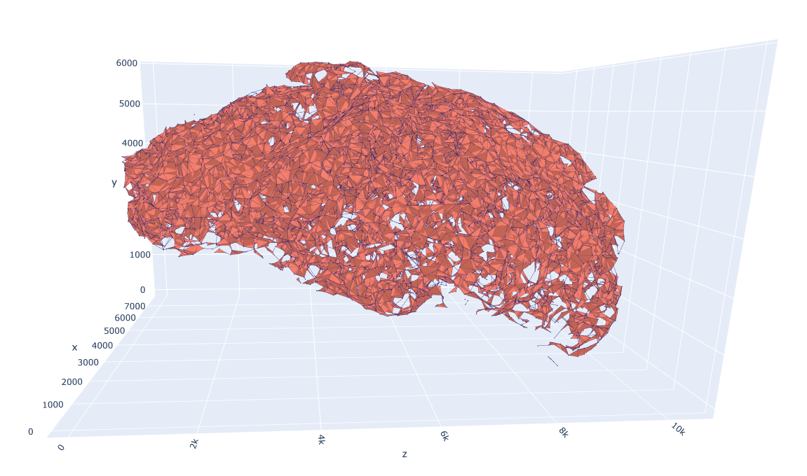
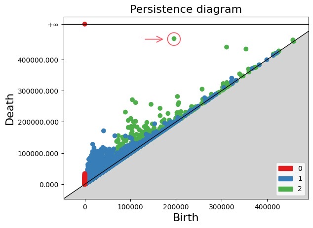

# ph-metric-graphs

Computation of persistent homology on metric graphs, with particular focus on vascular networks.

This repository is developed as part of the “Advanced Programming for Scientific Computing” course at Polytechnic University of Milan.

The aim is to use topological data analysis to study geometrical features of vascular networks. This allows the detection of anomalies, such as devascularized regions, which can be used for disease diagnosis purposes.

The project is developed in C++ and Python, using the [Gudhi](https://gudhi.inria.fr/) library for the computation of persistent homology.

## Example

The first image shows a particular step of the $\alpha$ - filtration of a real vascular network. The second one shows the corresponding persistence diagram. By observing the highlighted point, it becomes apparent that the network exhibits a significant devascularized void, which can be viewed as a potential risk factor for tumor development.




## Prerequisites

### Gudhi

To build `gudhi` you will need `cmake` $\geq$ 3.5,  `Boost` $\geq$ 1.66.0.

On Linux machines, it is sufficient to run:

```shell
sudo snap install cmake --classic # cmake
sudo apt-get install libboost-all-dev # Boost
```

To install and use the repository `cd` to the folder you wish to install it, and clone it:

```shell
git clone --recursive https://github.com/davide-gurrieri/ph-metric-graphs.git
```

To build and install `gudhi`:

```shell
git submodule update
cd gudhi-devel
mkdir build
cd build/
cmake -DCMAKE_BUILD_TYPE=Release ..
make
make install
```

### Python prerequisites

It is suggested the use of a virtual environment to install the required packages.

```shell
cd python
python3 -m venv env
source env/bin/activate
pip install -r requirements.txt
```

## Compilation and execution

To compile the C++ source code:

```bash
cd src/
mkdir build && cd build/
cmake ..
make
```

To run the program:

```bash
./network_analysis
```
